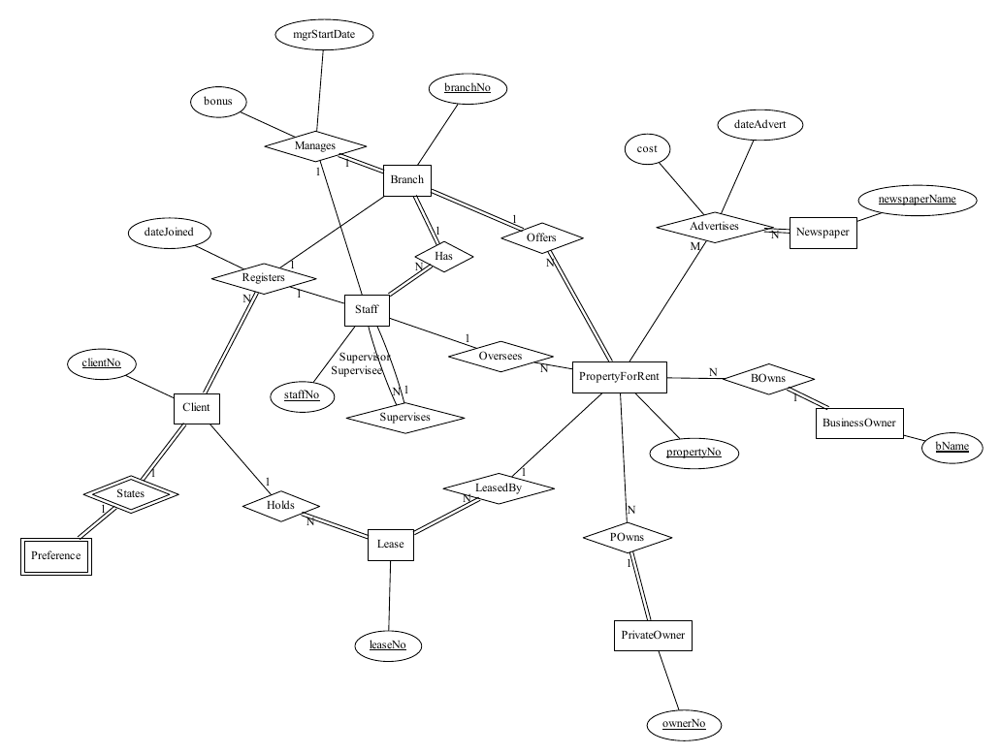

# ER Diagram Render



_(Diagram source code located at `./tests/property.py`)_

This is a package that lets you declare entity-relation diagrams programmatically and render them with graphviz.

Requisites:

- `graphviz` distributable
- `graphviz` Python package

How to install:

1. Clone this repository
2. Open a terminal at the root of the repository
3. Execute the following:
4. `pip install -e .`
5. This package will be installed in development mode


Quick start:

```python
from erd_render import quick_entity, Relation, COUNT, render_chen

# quick_entity is a helper function that helps you declare Entities quickly
staff = quick_entity(
    # declare the name first
    "Staff",
    [
        # then give a list of attributes
        # see documentation for erd_render.modules.helpers#parse_attribute for more info
        "*id",  # "*" prefix means it is a key attribute
        "name: firstName lastName",  # ":" means this is a composite attribute, subattributes are space-separated
        "addresses[]",  # "[]" postfix means it is a multi-value attribute
        "salary",
    ],
)

project = quick_entity(
    "Project",
    [
        "*id",
        "name",
    ],
)

rel = Relation(
    # give tuples for each entity in the relationship
    (staff, COUNT.AT_LEAST_ONE),
    (project, 1),  # assume each staff must work on exactly 1 project at any time
    name="worksOn",
)

# render the diagram, default output path is `graph.gv.pdf`
render_chen(
    [staff, project],
    [rel],
)
```

See `./tests` for more code and diagram examples.
